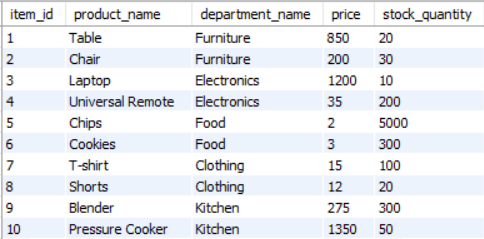

# CLI-APP

## BAMAZON

 Use Bamazon to look up items that are for sale. If there is something you would like to buy just enter the ID of the product you would like to buy and place the order including the quantity. 

 ## Choose from multiple categories

 
 * Electronics
 * Food
 * Kitchen
 * Furniture
 * Clothing

 ## How it works!
### Here is a image of the Database
 

### Users can choose an item using answering the prompt.
 

### If there is sufficient stock the order is placed and reflected in the Database

### If another order is placed 

### If there is insufficent stock you will recieve an error and order will not be placed.

